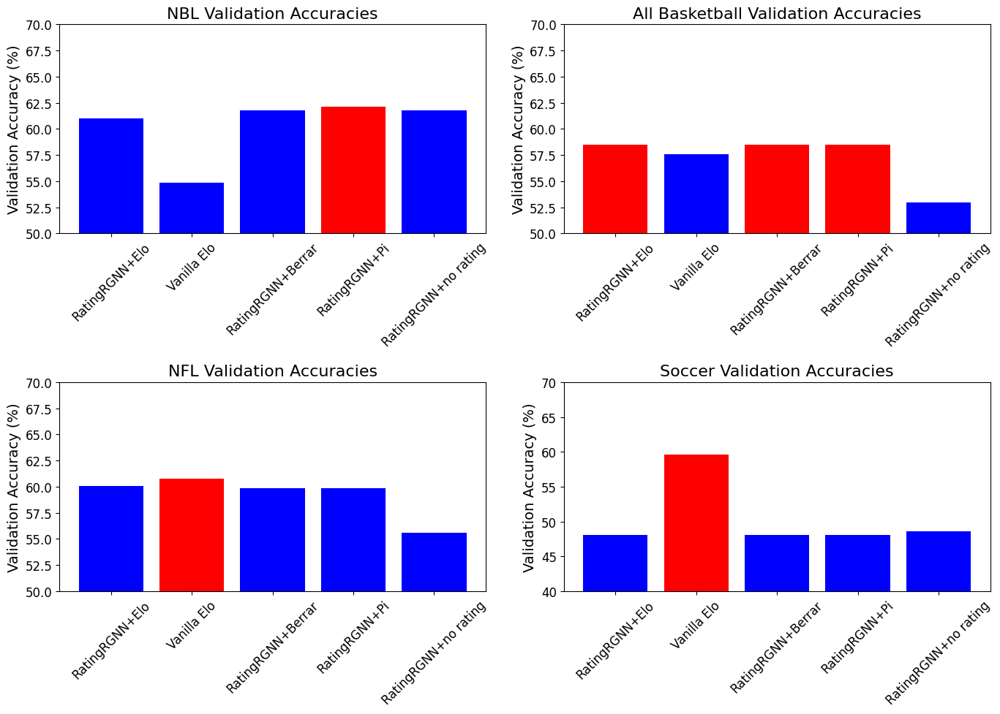
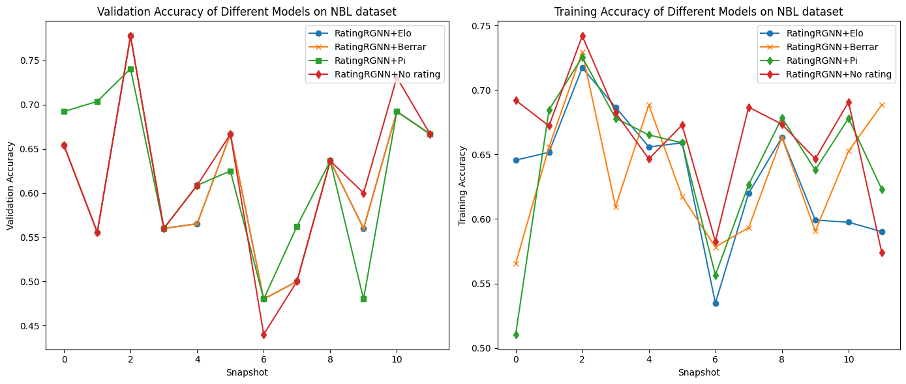

[](https://github.com/kubosis/NeRa/actions/workflows/test.yml)
[](https://codecov.io/gh/kubosis/NeRa) 


PyTorch based package for incorporating rating systems to neural networks.

### Prerequisities

```
Python >= 3.11
```

### Installation

```commandline
$ pip install --upgrade pip
$ pip install torch==2.1.2
$ pip install torch-scatter -f https://data.pyg.org/whl/torch-2.1.2+cpu.html
$ pip install torch-sparse -f https://data.pyg.org/whl/torch-2.1.2+cpu.html
$ pip install torch-geometric==2.4.0
$ pip install torch-geometric-temporal==0.52.0
$ pip install git+https://github.com/kubosis/NeRa.git
```

### Nera - Neural rating

This package implements seamless integration of statistical rating systems into graph neural network in the PyTorch environment.
This project was developed as my Bachelor's thesis.

### Implemented rating layers and recurrent graph neural network architectures

- Elo rating
- Berrar rating
- Pi rating 
- GConvElman
- RatingRGNN


### Showcases of predictive validation accuracy on collected datasets:

Note: the RatingRGNN was fine-tuned only on the NBL dataset and then applied across the other.



Note: the accuracy is across time snapshots. These snapshots represent seasons. They do not represents epochs of iterating the whole dataset. The training was done only for one epoch.

